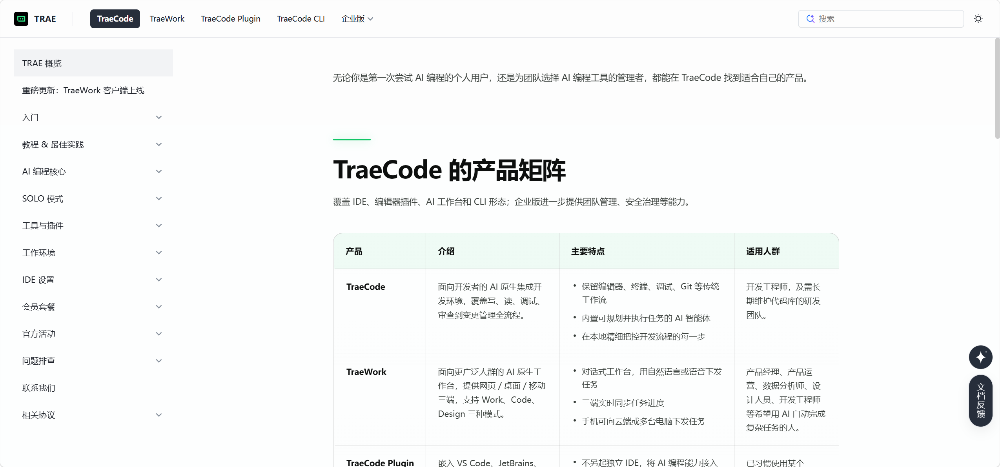
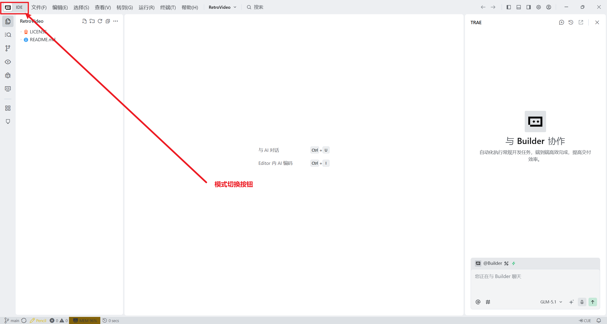
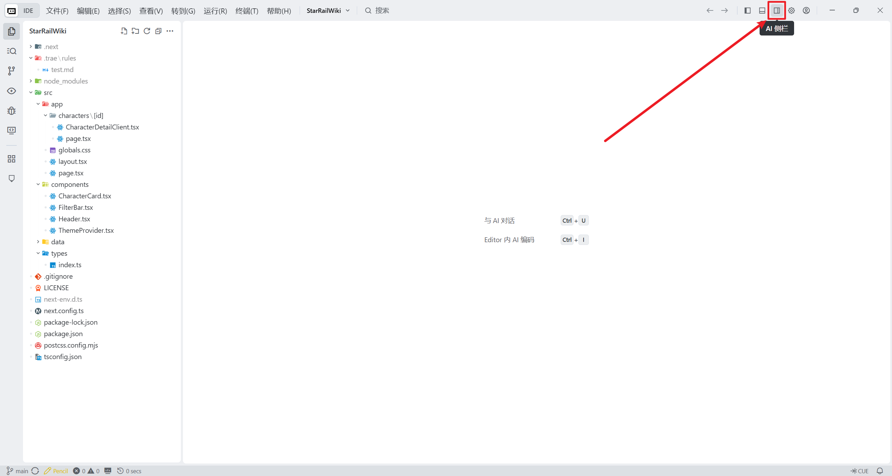
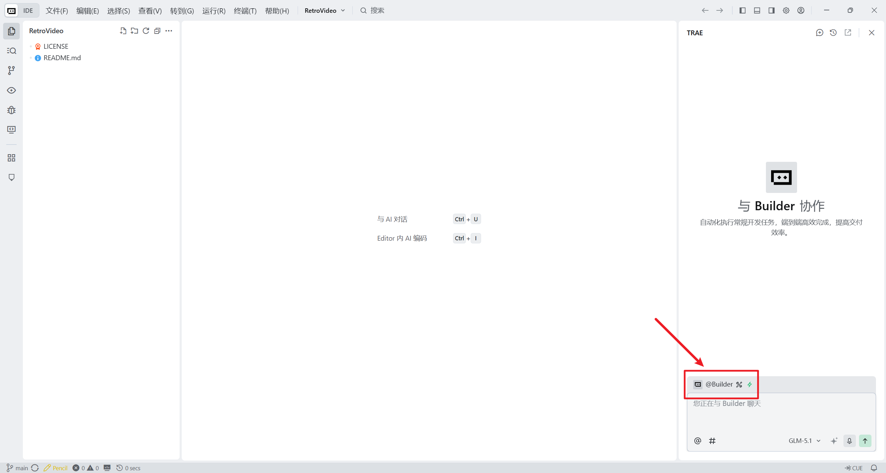
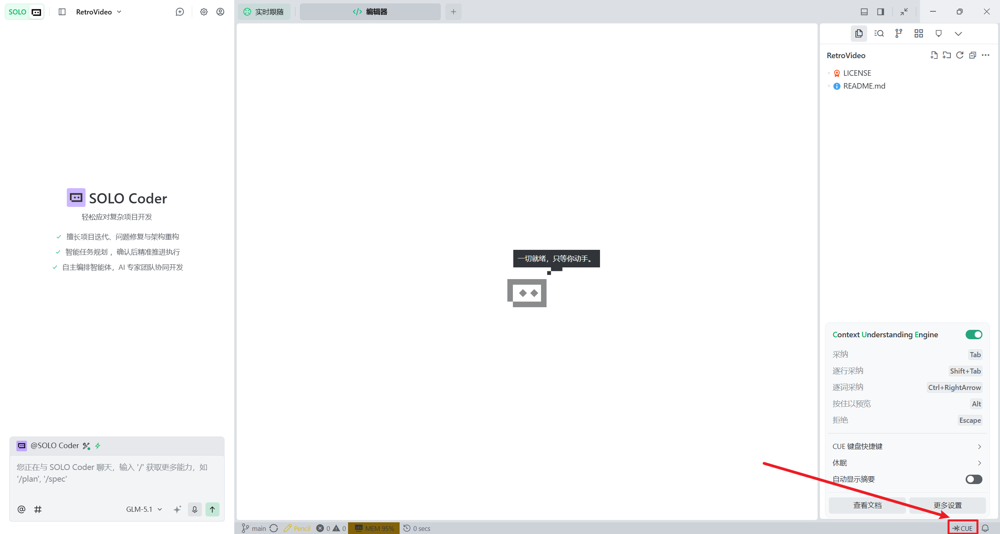
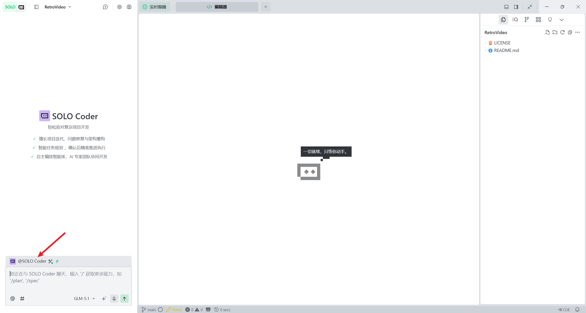
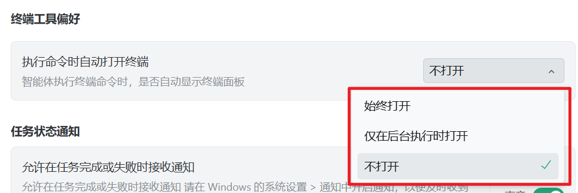

# TRAE 中国版（TraeCode）黑客松使用教程

**本教程为MINICAMP团队成员创作，转载请注明出处**

作者：陈柯名

> 面向两天制、约 4 人一队的黑客松。适合第一次接触编程的参赛者，也适合已经有开发经验的计算机相关专业学生。

| 项目 | 说明 |
|---|---|
| 适用产品 | TraeCode 中国版桌面端（原“TRAE IDE”） |
| 不在范围内 | TraeWork、TRAE 国际版、TraeCode Plugin、TraeCode CLI |
| 教程实战 | 纯前端“黑客松创意卡片墙” |
| 比赛形式 | 团队赛，推荐 4 人左右 |
| 比赛时长 | 2 天 |
| 成果展示 | 5 分钟现场演示 + 3 分钟评委问答 |
| 信息核对日期 | 2026-08-23 |

> **版本提示：**TRAE 中国版更新较快。2026 年 8 月，原“TRAE IDE”已升级品牌名称为 **TraeCode**。部分旧版界面、安装包或资料仍可能显示“TRAE IDE”“TRAE CN”。本教程统一使用“TraeCode”，并在需要时保留旧称方便识别。按钮位置可能随版本变化，请以客户端实际界面为准。

> **分发说明：**Markdown 文件本身不保存图片数据。为保证 Typora 等本地阅读器离线显示本文的 7 张截图，请保持本 `.md` 文件与 `images` 文件夹的相对位置不变。

---

## 目录

- [0. 如何使用本教程](#0-如何使用本教程)
- [1. 赛前准备](#1-赛前准备)
- [2. 10 分钟认识 TraeCode](#2-10-分钟认识-traecode)
- [3. 新手需要知道的基础概念](#3-新手需要知道的基础概念)
- [4. 与 AI 协作的正确流程](#4-与-ai-协作的正确流程)
- [5. 完整实战：黑客松创意卡片墙](#5-完整实战黑客松创意卡片墙)
- [6. 有经验开发者的进阶用法](#6-有经验开发者的进阶用法)
- [7. 四人团队协作](#7-四人团队协作)
- [8. 两天黑客松时间安排](#8-两天黑客松时间安排)
- [9. 5 分钟演示与 3 分钟问答](#9-5-分钟演示与-3-分钟问答)
- [10. 可复制的提示词模板库](#10-可复制的提示词模板库)
- [11. 安全、验证与常见误区](#11-安全验证与常见误区)
- [12. 故障排查](#12-故障排查)
- [13. 最终检查表与参考资料](#13-最终检查表与参考资料)

---

## 0. 如何使用本教程

文中使用四类标记：

- **【必读】**：所有参赛者都需要掌握。
- **【新手】**：解释项目、终端、依赖、浏览器控制台和 Git 等基础概念。
- **【进阶】**：介绍 Rules、SOLO Coder、上下文管理和代码审查。
- **【现场速查】**：比赛中可以直接复制或逐项检查。

### 推荐阅读路线

| 参赛者 | 建议路线 | 预计时间 |
|---|---|---:|
| 编程新手 | 按顺序阅读第 0～5 节，再阅读第 7～13 节 | 45～70 分钟 |
| 有开发经验 | 第 1～2 节 → 第 4～10 节 → 第 12～13 节 | 20～35 分钟 |
| 比赛过程中 | 第 8 节时间表 → 第 10 节提示词 → 第 12 节排障 | 按需 |
| 演示前 | 第 9 节 → 第 13 节演示检查表 | 10～15 分钟 |

### 先记住这五句话

1. 先让 AI 理解需求和项目，再让它改代码。
2. 一次只做一个可以验证的小任务。
3. AI 说“完成了”不等于真的完成了，必须自己运行和检查。
4. 每完成一个可运行阶段就提交 Git。
5. 黑客松优先保证核心流程稳定，不要在最后阶段大规模重构。

---

## 1. 赛前准备

### 1.1 【必读】下载正确的产品

TRAE 中国版目前包含多个产品。本教程需要的是 **TraeCode 桌面端**，它保留代码编辑器、文件树、终端、调试和 Git 等开发工作流，并支持 IDE 与 SOLO 两种开发模式。

注意TRAE同时拥有**中国版**和**国际版**，两者功能类似，主要差别在于国际版可以使用国外模型，中国版则不能。考虑到网络问题，使用国际版的用户应该对计算机和AI已经有了一定的了解，故本教程主要面向中国版用户，由于功能类似，国际版用户也可参考本教程使用。

不要误下载成 **TraeWork**。TraeWork 是独立的 AI 工作平台，界面和操作流程与本教程不同。

官方下载地址：

- [TRAE 中国版下载中心](https://www.trae.cn/ide/download)                                                        
- [TRAE 中国版官方文档](https://docs.trae.cn/)
- [TRAE 官方中文社区](https://forum.trae.cn/)



> 图 1：2026 年 8 月官方文档中的产品矩阵。TraeCode 面向开发者，保留编辑器、终端、调试和 Git 等开发流程。截图来源：[TRAE 官方中文社区的品牌升级说明](https://forum.trae.cn/t/topic/173667)。

下载中心当前提供 Windows、macOS 和 Linux 版本。安装前确认操作系统与处理器架构，Windows 用户通常选择 x64 版本，Apple 芯片 Mac 选择 Apple Silicon 版本。

### 1.2 安装、登录和首次启动

1. 从官方下载中心下载安装包。
2. 按安装程序提示完成安装。
3. 启动 TraeCode，使用自己的账号登录。
4. 如果客户端提示导入其他编辑器配置，新手可以跳过；已有 VS Code 等使用习惯的参赛者可按需导入。
5. 打开“帮助 → 关于”或设置中的版本信息，确认客户端可以正常启动并完成更新检查。
6. 新建一次 AI 对话，输入“只回复：环境检查成功”，确认模型可以响应。

> 主办方不统一提供账号。每位队员都应在比赛前自行完成注册和登录，不要四个人共用一个账号。模型、积分、排队和可用权益可能变化，本教程不写死具体模型名称或额度，以客户端实际显示为准。

### 1.3 建议的项目目录

第三方开发工具对特殊字符、超长路径或空格的兼容性不完全一致。为减少环境问题，建议使用较短的英文路径：

```text
Windows: D:\hackathon\idea-wall
macOS/Linux: ~/hackathon/idea-wall
```

这不是 TraeCode 的硬性要求，而是一种降低依赖安装和脚本兼容问题的做法。

### 1.4 根据技术栈检查开发环境

本教程的纯前端实战只需要 TraeCode 和浏览器。正式比赛技术栈不限，团队需要自行准备对应环境。

在 TraeCode 的终端中只运行与本队技术栈有关的命令：

| 用途 | 检查命令 | 看到什么算成功 |
|---|---|---|
| Git | `git --version` | 显示 Git 版本号 |
| Node.js | `node --version` | 显示 Node.js 版本号 |
| npm | `npm --version` | 显示 npm 版本号 |
| Python（Windows） | `python --version` 或 `py --version` | 显示 Python 版本号 |
| Python（macOS/Linux） | `python3 --version` | 显示 Python 版本号 |
| Java | `java -version` | 显示 Java 版本信息 |

如果出现“不是内部或外部命令”“command not found”等信息，说明对应运行环境没有安装，或者安装后终端尚未重新打开。

### 1.5 【现场速查】赛前检查表

```markdown
- [ ] 已从官方入口安装 TraeCode 中国版，而不是 TraeWork
- [ ] 每位成员都能独立登录
- [ ] AI 对话可以正常响应
- [ ] 可以创建并打开项目文件夹
- [ ] 集成终端可以正常输入命令
- [ ] 已安装本队技术栈所需的运行环境
- [ ] Git 可以正常使用
- [ ] 已准备共享代码仓库或其他可靠备份方式
- [ ] 已准备 Chrome、Edge、Firefox 等现代浏览器
- [ ] 已完成一次最小项目的运行测试
```

---

## 2. 10 分钟认识 TraeCode

### 2.1 IDE 模式与 SOLO 模式

TraeCode 桌面端通常提供两种开发方式：

| 模式 | 特点 | 黑客松中的建议 |
|---|---|---|
| IDE 模式 | 保留文件树、编辑器、终端、调试和源代码管理；可使用 Builder 等 AI 能力 | **本教程主线。**适合团队协作、逐步开发和审查变更 |
| SOLO 模式 | AI 主导规划并调用编辑器、终端等工具推进任务 | 进阶选用。适合较复杂、边界清晰的任务，使用前先提交 Git |



> 图 2：左上角模式切换入口的实际界面示例。截图来自中国版 3.3.50 的实际界面，当前版本的名称或位置可能略有变化。来源：[TRAE 官方中文社区使用指南](https://forum.trae.cn/t/topic/9361)。

本教程默认使用 **IDE 模式 + Builder**，原因是参赛者可以清楚看到文件、代码、命令和每次修改，更适合学习、团队合并和现场排障。

### 2.2 认识主界面

IDE 模式下重点关注五个区域：

1. **文件资源管理器**：查看项目目录和文件。
2. **代码编辑器**：阅读与手动修改代码。
3. **AI 侧栏**：输入需求、查看计划和文件变更。
4. **终端**：安装依赖、启动程序、运行测试和查看日志。
5. **源代码管理**：查看 Git 变更并提交阶段成果。

如果右侧 AI 面板没有显示，可以点击窗口右上方的 AI 侧栏图标；按钮位置可能随布局变化。



> 图 3：IDE 模式中的 AI 侧栏入口示例。来源：[TRAE 官方中文社区使用指南](https://forum.trae.cn/t/topic/9361)。

### 2.3 选择 Builder 并开始任务

在 AI 侧栏的智能体选择区域选择 **Builder**。Builder 可以读取项目、创建和修改文件，并按需执行开发命令。



> 图 4：Builder 选择区域。图中的工具图标可能因版本、账号能力或配置而不同；本教程不要求使用 MCP。来源：[TRAE 官方中文社区使用指南](https://forum.trae.cn/t/topic/9361)。

第一次对话可以输入：

```text
请先查看当前项目目录，只告诉我：
1. 项目里有哪些文件；
2. 你认为它使用了什么技术栈；
3. 如何运行。
暂时不要创建或修改任何文件，也不要安装依赖。
```

如果打开的是空文件夹，AI 应明确告诉你目录为空，而不是编造文件。

### 2.4 看懂 AI 的操作过程

Builder 工作时可能展示正在读取文件、编辑文件或运行命令等步骤。你需要关注：

- 它读取的是不是正确项目。
- 它准备修改哪些文件。
- 它要执行什么终端命令。
- 命令是否在等待你的确认。
- 完成后是否给出实际验证结果。

不要因为进度动画结束就认为项目已经可用。最终判断依据是：文件真实存在、程序能运行、验收条件通过。

### 2.5 审查、接受和撤销变更

不同版本可能使用“接受”“保留”“应用”“拒绝”“撤销”等文字。通用原则不变：

1. 打开 AI 修改过的文件。
2. 查看新增、删除和替换的代码。
3. 确认没有修改无关文件。
4. 确认没有删除队友代码或写入密钥。
5. 再保留需要的变更，撤销不需要的变更。

对于团队项目，**Git 提交是最可靠的阶段检查点**。不要只依赖对话中的回退按钮。

### 2.6 CUE 代码补全

CUE 会根据当前代码上下文提供补全建议。通常可按 `Tab` 接受、按 `Esc` 拒绝；实际快捷键可以在客户端设置中查看。



> 图 5：CUE 状态入口和快捷键示例。截图展示的是 SOLO 布局，但 IDE 模式也可以使用 CUE。来源：[TRAE 官方中文社区使用指南](https://forum.trae.cn/t/topic/9361)。

CUE 适合补全重复代码和小范围逻辑，不适合在没有验收标准时替你决定整个项目架构。

### 2.7 完成一次最小练习

1. 新建一个空文件夹并用 TraeCode 打开。
2. 选择 IDE 模式和 Builder。
3. 输入：

   ```text
   请创建 index.html，页面中央显示“TRAE 环境检查成功”。
   只使用 HTML，不安装任何依赖。完成后告诉我如何在浏览器打开。
   ```

4. 查看 AI 创建的 `index.html`。
5. 在浏览器中打开该文件。
6. 确认页面确实显示指定文字。

如果这六步全部成功，说明 TraeCode 的基础开发流程已经可用。

---

## 3. 新手需要知道的基础概念

### 3.1 【新手】项目和项目文件夹

一个项目通常由多个文件组成。TraeCode 会把你打开的文件夹视为当前工作区。AI 能看到哪些文件，首先取决于你打开了哪个文件夹。

例如：

```text
idea-wall/
├── index.html    # 页面内容和结构
├── style.css     # 页面外观
└── app.js        # 页面功能和数据
```

如果只打开了 `idea-wall/images`，AI 就无法自然理解上一级目录中的 `index.html` 和 `app.js`。遇到“AI 找不到文件”时，先检查工作区根目录。

### 3.2 【新手】HTML、CSS 和 JavaScript

可以把网页理解成：

- HTML：房间里有什么。
- CSS：房间如何装修。
- JavaScript：按钮按下后会发生什么。

本教程只使用浏览器原生能力，不使用 React、Vue、数据库或后端服务，因此环境最简单。

### 3.3 【新手】终端和命令

终端是通过文字命令操作电脑的窗口。命令可能会读取文件、启动程序、安装依赖，也可能删除文件或改变系统配置。

在执行 AI 建议的命令前，至少确认：

- 命令作用在哪个目录。
- 是否会安装新软件或依赖。
- 是否包含删除、覆盖、重置或上传操作。
- 是否需要管理员权限。

看不懂时可以先问：

```text
请逐段解释这条命令会读取、创建、修改或删除什么。
暂时不要执行，等我确认。
```

### 3.4 【新手】运行环境和依赖

运行环境是程序执行所需的软件，例如 Node.js、Python 或 Java。依赖是项目额外使用的代码包。

依赖越多，安装、网络和版本问题越多。两天黑客松中应优先使用团队熟悉的技术栈，不要仅因为 AI 推荐就临时引入复杂框架。

### 3.5 【新手】浏览器控制台

网页空白、按钮无反应时，不要只盯着页面。打开浏览器开发者工具：

- Windows/Linux 常用 `F12` 或 `Ctrl + Shift + I`。
- macOS 常用 `Option + Command + I`。

重点查看：

- **Console（控制台）**：JavaScript 错误。
- **Network（网络）**：资源或接口是否加载失败。
- **Elements（元素）**：页面元素是否存在。

复制错误时，连同错误信息、文件名和行号一起提供给 Builder。

### 3.6 【新手】localStorage

`localStorage` 是浏览器提供的本地存储。它适合保存本教程中的创意卡片，但不是正式数据库：

- 数据通常只保存在当前浏览器和当前站点。
- 换电脑或清理浏览器数据后可能消失。
- 不适合保存密码、令牌或敏感信息。
- 多个队员不会自动共享数据。

### 3.7 【新手】Git 提交

Git 可以记录代码变化。一次提交可以理解为一个可恢复的存档点。

最小工作流：

```bash
git status
git add .
git commit -m "feat: complete idea wall baseline"
```

执行 `git add .` 前先运行 `git status`，避免把 `.env`、密钥、构建产物或超大文件加入仓库。

---

## 4. 与 AI 协作的正确流程

### 4.1 一条有效提示词的五个部分

| 部分 | 要回答的问题 |
|---|---|
| 目标 | 最终要完成什么？ |
| 背景 | 当前项目、用户和现状是什么？ |
| 约束 | 哪些技术、文件或行为不允许？ |
| 验收标准 | 什么结果才算完成？ |
| 验证方式 | 如何运行、测试和证明？ |

通用模板：

```text
目标：

项目背景：

约束条件：

验收标准：

验证方式：
```

“帮我做一个好看的网页”没有边界，AI 只能猜。明确文件数量、功能、技术限制和验收条件，结果通常更稳定。

### 4.2 先分析，再实施

复杂任务分两轮：

第一轮：

```text
请先阅读相关文件并给出实施计划，列出准备修改的文件、风险和验证方法。
暂时不要修改文件，也不要运行安装命令。
```

确认计划后第二轮：

```text
计划确认。现在只实施第 1 步。
完成后运行对应验证，并列出实际修改的文件。不要顺带重构其他代码。
```

### 4.3 一次只做一件可以验证的事

不推荐：

```text
完成登录、支付、推荐算法、后台管理、部署和全部测试。
```

推荐拆分：

1. 先让登录页面可显示。
2. 再让表单校验可用。
3. 再接入登录接口。
4. 再处理错误状态。
5. 最后编写测试。

每一步都有可见结果，出错时也更容易定位。

### 4.4 使用“实施—运行—检查—提交”循环

每个任务都遵循：

```text
明确任务
  ↓
AI 给出计划
  ↓
实施小范围修改
  ↓
运行或测试
  ↓
人工检查差异
  ↓
Git 提交
```

如果验证失败，不要立刻让 AI 大规模重写。先提供完整错误、复现步骤和最近修改，让它定位最小根因。

### 4.5 不接受没有证据的“已完成”

要求 AI 区分：

- 它实际运行并看到的结果。
- 它只通过阅读代码推测的结果。
- 它没有条件验证的结果。

可以使用：

```text
请报告你实际执行了哪些验证命令、各自的退出状态和关键输出。
没有实际运行的项目不要写“已通过”，请标记为“未验证”。
```

---

## 5. 完整实战：黑客松创意卡片墙

### 5.1 项目目标

我们将创建一个纯前端“黑客松创意卡片墙”，让团队记录、筛选和点赞创意。

最终项目结构：

```text
idea-wall/
├── index.html
├── style.css
└── app.js
```

基础功能：

- 展示默认创意卡片。
- 添加标题、团队名、分类和简介。
- 检查必填字段。
- 按分类筛选。
- 搜索标题和简介。
- 点赞创意。
- 删除创意并二次确认。
- 使用 `localStorage` 保存数据。
- 刷新页面后恢复数据。
- 适配电脑和手机宽度。

示例分类暂定为：`AI 应用`、`校园生活`、`公共服务`、`绿色创新`、`其他`。

### 5.2 验收标准

```markdown
- [ ] 页面可以正常打开，没有明显布局错位
- [ ] 默认展示至少 3 张示例创意卡片
- [ ] 可以添加一张包含标题、团队、分类和简介的卡片
- [ ] 标题或团队名为空时不能提交，并显示可理解的提示
- [ ] 可以按分类筛选
- [ ] 可以按关键词搜索标题或简介
- [ ] 点赞只增加目标卡片的点赞数
- [ ] 删除前需要确认，取消后数据不变
- [ ] 刷新页面后新增卡片和点赞数仍然存在
- [ ] 用户输入以安全的文本方式展示，不执行其中的 HTML
- [ ] 浏览器控制台没有未处理错误
```

### 5.3 阶段 0：创建并打开项目

1. 创建空文件夹 `idea-wall`。
2. 在 TraeCode 中选择“文件 → 打开文件夹”。
3. 选择 `idea-wall`。
4. 切换到 IDE 模式。
5. 打开 AI 侧栏，选择 Builder。
6. 新建一个任务，命名为“创意卡片墙基础版”。

**预期结果：**左侧文件树显示空的 `idea-wall` 工作区，Builder 可以正常响应。

### 5.4 阶段 1：只制定计划

复制以下提示词：

```text
你是我的结对开发者。我们要为黑客松制作一个“创意卡片墙”。

目标：
使用纯 HTML、CSS 和原生 JavaScript 创建可在现代浏览器运行的单页应用。

技术约束：
1. 只创建 index.html、style.css、app.js 三个文件；
2. 不使用 React、Vue、TypeScript、后端、数据库或构建工具；
3. 不安装依赖，不使用外部 CDN；
4. 使用 localStorage 持久化数据；
5. 用户输入必须作为文本展示，不能直接拼接为可执行 HTML；
6. 当前阶段只制定计划，不创建或修改文件。

功能要求：
- 展示至少 3 张默认创意卡片；
- 添加标题、团队名、分类和简介；
- 必填校验；
- 分类筛选和关键词搜索；
- 点赞；
- 删除前二次确认；
- 刷新后保留数据；
- 响应式布局。

请输出：
1. 三个文件各自的职责；
2. 创意数据结构；
3. 分阶段实施顺序；
4. 每一阶段的验证方法；
5. 主要风险。
```

检查 AI 的计划：

- 是否只使用三个文件。
- 是否没有引入框架和依赖。
- 是否定义稳定的卡片 ID。
- 是否考虑输入校验和安全渲染。
- 是否每个阶段都有验证方式。

如果计划超出范围，回复：

```text
请删去所有框架、依赖、后端和部署内容，严格限制为三个静态文件，然后重新给出计划。
```

### 5.5 阶段 2：生成页面骨架

确认计划后输入：

```text
计划确认。现在只实现页面骨架和默认卡片展示：

1. 创建 index.html、style.css、app.js；
2. 页面包含标题区、添加创意表单、搜索框、分类筛选区和卡片列表；
3. 在 app.js 中定义至少 3 条默认数据并渲染；
4. 本阶段暂不实现 localStorage、点赞和删除；
5. 使用语义化 HTML，表单控件都有 label；
6. 不添加外部依赖或 CDN。

完成后检查三个文件之间的引用路径，并告诉我如何验证页面。
```

**预期结果：**

- 文件树出现三个文件。
- 浏览器可以显示标题、表单、筛选区和默认卡片。
- Console 没有资源路径或 JavaScript 语法错误。

如果 AI 顺带实现了其他功能，不必立刻删除，但要检查是否引入了依赖或复杂度。

### 5.6 运行页面

最简单的方法是直接在文件管理器中双击 `index.html`。为了让本地存储和浏览器行为更稳定，建议使用本地 HTTP 服务。

如果已安装 Python，可在项目目录运行：

```bash
# Windows，二选一
py -m http.server 8080
python -m http.server 8080

# macOS/Linux
python3 -m http.server 8080
```

然后访问：

```text
http://localhost:8080
```

停止服务通常按 `Ctrl + C`。

> 如果端口 8080 被占用，可改成 8081。不要为了释放端口而结束所有 Node、Python 或系统进程。

### 5.7 阶段 3：实现添加与本地存储

```text
现在只实现“添加创意”和 localStorage：

1. 标题和团队名为必填项；
2. 对输入内容去除首尾空白；
3. 无效输入应在表单附近显示清晰提示；
4. 每张卡片使用稳定且唯一的 id；
5. localStorage 的键名固定为 hackathon-idea-wall:v1；
6. 首次使用时加载默认数据，之后优先加载已保存数据；
7. 用户输入必须通过 textContent 等安全方式展示，禁止把用户输入直接写入 innerHTML；
8. 添加成功后清空表单并立即刷新卡片列表；
9. 不修改与本任务无关的页面结构和样式。

完成后列出修改点，并给出手动验证步骤。
```

手动验证：

1. 空标题提交，应显示错误。
2. 输入完整信息，应新增一张卡片。
3. 刷新浏览器，新卡片仍存在。
4. 输入 `` 作为标题，页面应把它显示成普通文字，而不是执行。

### 5.8 阶段 4：实现筛选、搜索、点赞和删除

```text
在当前可运行版本上增加以下功能：

1. 分类筛选：选择“全部”时显示所有卡片；
2. 关键词搜索：不区分大小写地匹配标题或简介；
3. 筛选和搜索可以同时生效；
4. 点赞只更新目标卡片并立即保存到 localStorage；
5. 删除前使用明确的二次确认，取消时不能改变数据；
6. 删除后立即更新列表和 localStorage；
7. 没有匹配结果时显示空状态；
8. 不改变现有数据结构，不进行无关重构。

完成后按照每项功能分别给出验证步骤。
```

检查重点：

- 过滤后点赞，是否仍然更新正确卡片。
- 搜索和分类同时使用时，结果是否正确。
- 取消删除后数据是否保持不变。
- 刷新后点赞和删除结果是否保留。

### 5.9 阶段 5：改善视觉和可访问性

```text
在不改变功能逻辑的前提下优化界面：

1. 风格简洁、有黑客松氛围，但不要使用外部图片、字体或 CDN；
2. 使用 CSS 变量统一颜色、间距和圆角；
3. 桌面端使用自适应卡片网格；
4. 按钮、输入框和筛选控件具有明显的 hover 与 focus 状态；
5. 保证文字和背景有足够对比度；
6. 动画保持轻量，并兼容 prefers-reduced-motion；
7. 只修改必要的 HTML 和 style.css，不重写 app.js 功能逻辑。

完成后列出你实际检查的桌面宽度。
```

不要只评价“更好看了”。至少检查：

- 约 1280px 宽度。
- 键盘能否移动到表单和按钮。
- 焦点位置是否可见。

### 5.10 阶段 6：故障定位演练

先创建 Git 检查点。然后让 Builder 设计一个容易恢复的单行错误：

```text
请先阅读当前项目，为我设计一个安全、可恢复的单行前端故障演练。
要求故障只影响卡片渲染，不删除数据、不修改 localStorage。
先告诉我准备改哪一行、预期现象和恢复方法，暂时不要执行。
```

确认后实施故障，刷新页面并复制 Console 错误。再新建一个任务输入：

```text
现象：页面可以打开，但卡片没有显示。

复现步骤：
1. 启动本地服务器；
2. 打开首页；
3. 卡片区域为空。

控制台错误：
【粘贴完整错误、文件名和行号】

最近修改：
【说明刚才改动的一行】

请先解释最可能的根因，再给出最小修复方案。只修复这个问题，不要重构。
修复后重新运行对应检查。
```

演练结束后确认页面恢复，并提交 Git。

### 5.11 阶段 7：按验收标准审查

```text
请根据下面的验收标准审查当前项目。

要求：
1. 对每一项标记“通过、失败或未验证”；
2. 给出对应文件和代码证据；
3. 只有实际运行过的检查才能写“运行通过”；
4. 暂时不要修改代码；
5. 最后按影响演示的严重程度排序失败项。

【粘贴本教程 5.2 节的验收清单】
```

你自己仍需在浏览器中逐项操作。AI 的静态代码审查不能替代真实交互测试。

### 5.12 阶段 8：提交阶段成果

如果项目还没有 Git 仓库：

```bash
git init
git status
git add index.html style.css app.js
git commit -m "feat: complete hackathon idea wall"
```

如果 Git 提示没有配置姓名或邮箱，按提示配置自己的 Git 身份后再提交。不要把别人的身份信息直接复制过来。

建议至少保留这些提交：

```text
chore: initialize idea wall
feat: add idea form and persistence
feat: add filters likes and deletion
style: improve responsive interface
fix: resolve verified rendering issue
```

### 5.13 可选挑战

完成基础验收后，每次只选择一个：

- 按最新或点赞数排序。
- 导出和导入 JSON 数据。
- 提供“恢复示例数据”按钮。
- 加入深色模式。
- 根据正式比赛主题替换分类、文案和示例数据。
- 为核心数据函数编写不依赖框架的最小测试。

---

## 6. 有经验开发者的进阶用法

### 6.1 IDE Builder 与 SOLO Coder 怎么选

| 场景 | 推荐方式 | 原因 |
|---|---|---|
| 初次理解代码库 | IDE + Builder | 可以边读文件边控制上下文 |
| 小范围功能修改 | IDE + Builder | 容易审查差异并控制修改范围 |
| 团队成员各自开发 | IDE + Builder | 与分支、终端和 Git 工作流结合自然 |
| 复杂但边界明确的独立任务 | SOLO Coder | 适合先规划再连续推进多个步骤 |
| 演示前紧急修复 | IDE + Builder | 人工控制更精细，风险更低 |
| 大范围架构重构 | 独立分支 + 计划模式 | 必须先建立检查点并分阶段验证 |

SOLO Coder 的界面由 AI 任务区和编辑器等工具组成，更偏向 AI 主导。启用前先确认当前分支干净并完成 Git 提交。



> 图 6：SOLO Coder 的实际界面示例。中国版当前能力和布局可能继续变化，请以客户端实际显示为准。来源：[TRAE 官方中文社区使用指南](https://forum.trae.cn/t/topic/9361)。

SOLO 模式中的新任务如果支持 Plan 开关，可先开启计划再执行。不要把“自动化程度更高”理解为“不需要人工审查”。

### 6.2 使用项目 Rules 固定团队约束

TraeCode 支持项目级规则。规则通常保存在项目的 `.trae/rules/` 目录中，可以和代码一起提交，让团队成员的 AI 采用相同约束。

示例文件：

```text
.trae/
└── rules/
    └── hackathon-rules.md
```

示例内容：

```markdown
# 黑客松项目规则

- 使用简体中文说明计划和结果。
- 修改前先读取相关文件，复杂任务先给计划。
- 一次只处理当前任务，不做无关重构。
- 不删除或覆盖队友代码；发现冲突先报告。
- 不把密钥、令牌或个人数据写入代码和日志。
- 不运行破坏性 Git 命令，不自动强制推送。
- 新增依赖前说明用途、许可证和替代方案，等待确认。
- 完成后列出修改文件、运行命令、实际验证结果和未验证项。
```

规则应短、清晰、没有相互冲突。临时需求应写在当前提示词中，不要不断把所有对话内容塞进项目规则。

### 6.3 控制上下文

AI 输出开始变慢、忽略新要求或反复犯同一错误时：

1. 停止继续追加不相关问题。
2. 让 AI 总结当前目标、已完成内容、未完成内容和关键文件。
3. 保存总结。
4. 新建任务，只附上必要背景和文件。
5. 重新明确验收标准。

建议一个任务只处理 1～2 个紧密相关的目标。不要在同一个对话里先做前端、再问比赛规则、再写路演稿、然后返回修后端 Bug。

### 6.4 精确指定上下文

有经验的开发者可以明确告诉 Builder：

```text
请只阅读以下文件：
- src/components/IdeaCard.tsx
- src/services/ideas.ts
- tests/ideas.test.ts

目标是修复点赞重复提交问题。不要读取构建产物和 node_modules，不要修改公共 API。
```

如果 AI 需要更多文件，应先说明为什么，而不是直接遍历整个磁盘。

### 6.5 要求最小差异

```text
请优先给出最小修复：
- 不改变函数签名；
- 不升级依赖；
- 不重命名公共符号；
- 不格式化无关文件；
- 修改后运行现有测试。
```

小差异更容易审查、回退和合并，也更适合两天比赛。

### 6.6 让 AI 做代码审查，而不是自我表扬

```text
请以严格代码审查者身份检查当前分支相对主分支的变更。

重点检查：
1. 会影响演示的功能错误；
2. 数据丢失和并发问题；
3. 用户输入、密钥和权限风险；
4. 未处理的错误状态；
5. 明显的性能问题；
6. 缺失的测试。

只报告有代码证据的问题，按严重程度排序，并给出文件和位置。
暂时不要修改代码。
```

审查结果仍需人工判断。不要为了消除所有建议，在演示前引入大规模修改。

### 6.7 MCP、Skills 和自定义智能体

这些能力可以连接外部工具或封装重复流程，但不是完成本教程实战的前提。

黑客松建议：

- 赛前已经熟悉并验证过的工具可以使用。
- 比赛中不要临时安装来源不明的 MCP 或 Skill。
- 连接外部服务前检查权限、数据范围和密钥保存方式。
- 任何工具故障都应有手动替代流程。

---

## 7. 四人团队协作

### 7.1 推荐分工

| 成员 | 主要职责 | 创意卡片墙练习中的任务 |
|---|---|---|
| A：产品与集成 | 明确需求、拆分任务、控制范围、合并代码 | 维护验收标准、页面结构和最终集成 |
| B：界面与体验 | 页面布局、视觉、响应式和可访问性 | 主要负责 `style.css` |
| C：功能与数据 | 核心逻辑、数据模型、接口和错误处理 | 主要负责 `app.js` |
| D：测试与演示 | 测试、Bug 复现、README、演示数据和答辩 | 维护检查表、故障清单和演示脚本 |

这只是参考，不是四个互不沟通的岗位。所有成员都应知道项目如何启动、核心流程是什么、当前稳定版本在哪里。

### 7.2 建立共同事实

比赛开始后，团队先共同写下：

- 一句话问题定义。
- 目标用户。
- 5 分钟内必须演示的核心流程。
- MVP 必须包含的功能。
- 明确不做的功能。
- 技术栈和启动命令。
- 数据、账号和外部 API 风险。
- 每项任务的负责人和验收方式。

如果四名成员把不同版本的需求分别告诉 AI，代码很快会相互冲突。

### 7.3 分支和提交建议

每位成员使用独立分支，例如：

```text
main
feature/layout
feature/idea-actions
feature/storage
test/demo-check
```

典型命令：

```bash
git switch -c feature/idea-actions
git status
git add app.js
git commit -m "feat: add likes and deletion"
```

合并前：

1. 获取团队最新代码。
2. 在自己的分支运行项目和测试。
3. 查看 `git status` 与差异。
4. 确认提交不包含密钥和无关文件。
5. 再交给负责集成的成员合并。

> 仓库默认分支可能叫 `main` 或 `master`。命令中的名称要替换成团队实际分支，不要盲目复制。

### 7.4 防止 AI 覆盖队友工作

给每个任务附加：

```text
这是团队协作项目。
只修改本任务列出的文件；如果必须修改其他文件，先说明原因并等待确认。
不要删除、重命名或重写你不理解的队友代码。
不要格式化整个仓库。
```

尽量按模块分工，而不是让四个人同时修改一个大型文件。如果不得不修改同一文件，约定先后顺序并及时合并。

### 7.5 处理 Git 冲突

出现下面内容说明有合并冲突：

```text
<<<<<<< HEAD
当前分支内容
=======
另一分支内容
>>>>>>> feature/example
```

正确做法：

1. 暂停让 AI 继续生成新代码。
2. 找到双方负责成员，确认两段代码各自意图。
3. 人工决定保留或组合的内容。
4. 删除冲突标记。
5. 重新运行相关功能。
6. 再完成合并提交。

不要直接让 AI “随便解决所有冲突”。它可能生成语法正确但业务错误的结果。

### 7.6 固定集成节奏

建议：

- 每 2～3 小时集成一次。
- 每次集成后走一遍核心流程。
- 第一天结束前保留一个可演示版本。
- 第二天下午设置“功能冻结”时间。
- 冻结后只修复影响演示的问题。

### 7.7 团队状态同步模板

每次短会每人只回答：

```text
已完成：
正在做：
下一步：
阻塞项：
涉及文件/接口：
预计何时可合并：
```

---

## 8. 两天黑客松时间安排

时间可按赛事日程调整，关键是阶段目标。

### 第一天：先得到能运行的核心闭环

| 阶段 | 团队目标 | 结束条件 |
|---|---|---|
| 开始后 0～1 小时 | 理解主题、用户和评审目标 | 一句话问题定义得到全队确认 |
| 1～2 小时 | 确定 MVP、技术栈和分工 | 写出“必须做/明确不做”清单 |
| 2～4 小时 | 建项目、完成第一条端到端流程 | 最小版本可以从入口走到结果 |
| 4～8 小时 | 四人并行完成核心模块 | 各分支有可验证的小提交 |
| 当天后段 | 第一次完整集成、修复阻塞问题 | 主分支可以启动并完成核心流程 |
| 离场前 | 备份、记录启动方式和已知问题 | 任意一名队员能在新终端启动项目 |

第一天离场前至少做到：

```markdown
- [ ] 主分支可以运行
- [ ] 核心流程至少成功走通一次
- [ ] 所有人的有效代码已经推送或可靠备份
- [ ] 关键配置和启动命令已有记录
- [ ] 已知问题按严重程度排序
- [ ] 明天第一项任务已经明确
```

### 第二天：稳定、验证和演示

| 阶段 | 团队目标 | 结束条件 |
|---|---|---|
| 上午前段 | 合并剩余核心功能 | 没有长期分叉的关键分支 |
| 上午后段 | 异常处理、测试、修复 | 主要验收项通过 |
| 下午前段 | 功能冻结、准备演示数据 | 不再增加非必要功能 |
| 演示前 2～3 小时 | 两轮完整排练和备用方案 | 5 分钟内稳定完成演示 |
| 演示前 30 分钟 | 只做设备和最终检查 | 使用最后稳定提交，不再重构 |

### 删减功能的判断方法

当时间不足时，按以下顺序保留：

1. 评委能够看到的核心价值。
2. 能让核心流程成功的功能。
3. 防止演示失败的错误处理。
4. 提升理解的必要视觉效果。
5. 其余优化和“未来也许有用”的功能。

---

## 9. 5 分钟演示与 3 分钟问答

### 9.1 五分钟时间分配

| 时间 | 内容 | 目标 |
|---|---|---|
| 0:00～0:30 | 用户痛点和场景 | 让评委知道为什么值得解决 |
| 0:30～1:00 | 一句话方案 | 说明产品为谁提供什么价值 |
| 1:00～3:30 | 核心流程现场演示 | 展示一个完整、稳定的“黄金路径” |
| 3:30～4:15 | 技术实现与 TRAE 使用方式 | 说明架构、团队分工和验证方法 |
| 4:15～4:45 | 创新点和实际价值 | 强调与普通方案的区别 |
| 4:45～5:00 | 总结 | 留下一句可记住的结论 |

五分钟只展示 2～3 个最有价值的功能。不要现场安装依赖、输入大段文字或展示所有设置页面。

### 9.2 创意卡片墙的示例脚本（可根据产品自行调整）

```text
0:00～0:30
黑客松团队经常在聊天群和文档中分散记录创意，重复方案难以发现，优秀想法也缺少快速反馈。

0:30～1:00
我们制作了【主题名称】创意卡片墙，让团队可以集中提交、筛选和点赞创意，在几分钟内形成共同优先级。

1:00～3:30
1. 展示已有卡片；
2. 添加一条符合比赛主题的新创意；
3. 使用分类和搜索定位它；
4. 点赞并刷新页面，证明数据被保存；
5. 展示删除确认或手机布局中的一个亮点。

3:30～4:15
项目使用纯 HTML、CSS、JavaScript 和 localStorage。四名成员分别负责需求集成、界面、功能数据、测试演示。我们用 TraeCode 规划小任务、生成和修改代码、分析错误，并通过人工验收和 Git 提交验证结果。

4:15～4:45
与普通静态展示页相比，它形成了从创意收集到筛选反馈的完整交互闭环，并可以按比赛主题快速定制。

4:45～5:00
我们希望让每个创意都被看见，也让团队把时间花在最值得实现的方案上。
```

### 9.3 四人现场分工（仅供参考）

| 成员 | 现场职责 |
|---|---|
| A | 主讲，控制整体节奏和开场结尾 |
| B | 操作产品，不同时承担大段讲解 |
| C | 回答架构、代码、安全和 AI 使用问题 |
| D | 回答用户价值问题，负责计时和备用演示 |

正式演示时尽量只由主讲和操作人员发言，避免四个人频繁交接。

### 9.4 三分钟问答

三分钟通常只能回答 2～4 个问题。回答采用：

```text
结论 → 一条证据 → 当前边界或下一步
```

示例：

> 问：为什么使用 localStorage，不使用数据库？
>
> 答：因为两天内我们优先验证创意筛选的核心流程。当前数据保存在单机浏览器，保证现场演示稳定；如果继续开发，下一步会接入带身份和团队空间的后端数据库。

重点准备：

- 解决了谁的什么问题？
- 与已有方案相比有什么创新？
- 为什么选择当前技术栈？
- 哪些工作由 TraeCode 辅助，哪些由团队决策和验证？
- 如何确认 AI 生成代码正确？
- 数据、隐私和安全如何处理？
- 当前原型有什么限制？
- 如果再有一周，下一步是什么？

不知道时不要编造，可以回答：

> 当前原型还没有验证这一点。我们已经识别到风险，下一步会通过【具体方法】验证。

### 9.5 演示失败的备用方案

准备三层保障：

1. **本地稳定版本**：固定 Git 提交、固定测试数据、已安装依赖。
2. **完整录屏**：从打开产品到完成核心流程，时长不超过现场演示。
3. **关键截图**：每个核心步骤一张，断网或设备故障时仍能讲清。

现场故障超过约 20 秒仍无法恢复，应切换到录屏或截图继续讲，而不是让大家看团队调试。

---

## 10. 可复制的提示词模板库

### 10.1 分析比赛主题

```text
你是黑客松产品顾问。请根据以下比赛主题分析：

主题：【粘贴主题】
评审标准：【粘贴标准；未知则写未知】
团队能力：【列出熟悉技术】
开发时间：两天
演示时间：5 分钟

请输出：
1. 5 个具体用户问题；
2. 每个问题的目标用户和真实使用场景；
3. 两天内可以完成的最小验证方案；
4. 主要技术和演示风险；
5. 不要把技术名词本身当作用户价值。
```

### 10.2 比较技术方案

```text
请比较下面三个技术方案，不要直接替团队决定：

方案 A：【内容】
方案 B：【内容】
方案 C：【内容】

从团队熟悉度、两天内完成概率、离线演示能力、外部依赖、调试成本、安全风险和后续扩展比较。
最后给出推荐方案及放弃其他方案的具体理由。
```

### 10.3 阅读现有项目

```text
请先阅读当前项目，暂时不要修改文件。

输出：
1. 技术栈和入口文件；
2. 项目启动与测试命令；
3. 与当前需求最相关的文件；
4. 数据流或调用链；
5. 你尚不确定、需要我确认的事项。

不要遍历依赖目录、构建产物和敏感配置。
```

### 10.4 制定 MVP

```text
目标用户：【填写】
核心问题：【填写】
比赛主题：【填写】
开发时间：两天
演示时间：5 分钟

请把功能分成：
- 必须有：没有它就无法证明核心价值；
- 应该有：能显著改善演示，但可以延后；
- 可以有：只在时间充足时做；
- 明确不做：两天内风险过高。

为“必须有”的每项功能写出可操作的验收标准。
```

### 10.5 实现单个功能

```text
目标：【一个具体功能】

相关文件：【列出文件】
约束：【接口、技术栈、不能修改的内容】
验收标准：【可操作检查】
验证方式：【运行命令或手动步骤】

请先给出不超过 5 步的计划和准备修改的文件，暂时不要实施。
```

计划确认后：

```text
计划确认。现在实施该功能。
只修改必要文件，不做无关重构。
完成后运行验证，并分别列出：实际修改、实际运行、未验证项。
```

### 10.6 定位 Bug

```text
现象：【用户看到什么】
预期：【本应发生什么】
复现步骤：【按顺序列出】
错误信息：【完整粘贴】
最近修改：【文件或提交】
运行环境：【操作系统、浏览器或运行时版本】

请先定位最可能根因并说明证据，再给出最小修复方案。
不要升级依赖、重构模块或修改无关文件。
修复后重新运行能够覆盖该问题的验证。
```

### 10.7 生成测试清单

```text
请为当前功能生成手动测试清单，覆盖：
- 正常流程；
- 空输入和非法输入；
- 重复操作；
- 刷新或重新启动；
- 网络或外部服务失败；
- 手机和桌面宽度；
- 数据安全和隐私。

每一项写明操作、预期结果和失败时要收集的信息。
```

### 10.8 演示前代码审查

```text
距离现场演示只剩【时间】。请审查当前项目，只报告可能导致以下问题的缺陷：
1. 项目无法启动；
2. 核心演示流程中断；
3. 数据丢失或明显错误；
4. 密钥、隐私或高风险安全问题；
5. 手机或演示分辨率下无法操作。

按严重程度排序。不要建议架构重构、依赖升级或纯风格优化。
暂时不要修改代码。
```

### 10.9 生成 README

```text
请根据当前项目的真实代码生成 README 草稿，包含：
- 项目解决的问题；
- 核心功能；
- 技术栈；
- 安装与启动步骤；
- 环境变量说明，但绝不写入真实密钥；
- 四人分工；
- 已知限制；
- 后续计划。

无法从代码确认的内容标记为“待团队补充”，不要编造用户数、准确率或性能数据。
```

### 10.10 生成五分钟演示稿

```text
你是黑客松路演教练。请根据当前项目代码、README 和以下信息生成严格不超过 5 分钟的演示稿：

目标用户：【填写】
核心问题：【填写】
演示黄金路径：【填写】
最重要的两个亮点：【填写】

按 0:00～0:30、0:30～1:00、1:00～3:30、3:30～4:15、4:15～4:45、4:45～5:00 分段。
不要声称项目实现了代码中不存在的功能，不要编造指标。
```

### 10.11 模拟评委问答

```text
你是一名严格的黑客松评委。

请根据当前项目的 README、源代码和演示稿：
1. 从产品、技术、创新、可行性、安全、AI 使用六个角度提出 12 个问题；
2. 标记最可能出现的 5 个问题；
3. 为每个问题给出不超过 25 秒的回答框架；
4. 指出回答所需证据；
5. 不要虚构尚未实现的功能或数据。
```

---

## 11. 安全、验证与常见误区

### 11.1 密钥和个人数据

不要把以下内容发给 AI、写入代码或提交仓库：

- API Key、访问令牌和密码。
- `.env` 中的真实值。
- 云服务密钥文件。
- 身份证、手机号、真实用户数据。
- 未脱敏的比赛后台或组织内部资料。

代码中只保留占位符：

```text
API_KEY=your_api_key_here
```

将真实值保存在本地环境变量或平台的密钥管理功能中，并把 `.env` 加入 `.gitignore`。

### 11.2 谨慎执行终端命令

看到以下行为应停下来检查：

- 递归删除目录。
- 强制覆盖文件。
- Git 强制推送、硬重置或清理未跟踪文件。
- 下载并立即执行未知脚本。
- 申请管理员权限。
- 修改系统防火墙、注册表或全局运行环境。
- 把本地文件上传到外部地址。

不要通过关闭所有安全确认来解决“每次都要授权”的不便。比赛中使用手动确认通常更安全。

### 11.3 新依赖的四个问题

安装前问：

1. 为什么现有技术栈不能完成？
2. 包的来源和许可证是什么？
3. 会增加多少安装、构建和演示风险？
4. 断网时是否还能运行？

### 11.4 AI 生成不代表版权和许可证自动合规

使用第三方代码、字体、图片、模型或数据集时，团队仍需确认许可证、署名要求和比赛规则。不要让 AI 编造素材来源。

### 11.5 常见误区

| 误区 | 更好的做法 |
|---|---|
| 一句话让 AI 做完整项目 | 先定 MVP，再按可验证小任务实施 |
| AI 说测试通过就相信 | 查看它实际运行的命令和输出，自己重跑 |
| 出错就让 AI 重写全部代码 | 提供复现步骤和完整错误，要求最小修复 |
| 四个人同时让 AI 重构 | 按模块分支开发，定期集成 |
| 为了高级感临时换新框架 | 优先使用团队最熟悉、最稳定的技术栈 |
| 最后两小时继续加功能 | 功能冻结，转向稳定、排练和备用方案 |
| 把 AI 当作成果主体 | 清楚说明团队决策、验证和 AI 辅助范围 |

---

## 12. 故障排查

### 12.1 下载后界面与教程完全不同

**可能原因：**下载了 TraeWork，而不是 TraeCode。

**处理：**返回[官方下载中心](https://www.trae.cn/ide/download)，选择 TraeCode 桌面端。TraeWork 左上角可能显示 Work、Code、Design 等工作模式，它不是本教程所用的 IDE/SOLO 双模式编辑器。

### 12.2 无法登录或 AI 没有响应

按顺序检查：

1. 普通网页是否可以访问。
2. 系统日期和时间是否正确。
3. 客户端是否提示更新或重新登录。
4. 新建任务后是否仍无响应。
5. 其他队员是否同时出现，判断是否为服务问题。
6. 查看[官方中文社区的帮助与支持](https://forum.trae.cn/c/7-category/7)。

不要在群聊中公开会话 ID、账号信息、密钥或完整日志；提交问题前先脱敏。

### 12.3 找不到 AI 侧栏

- 查看窗口右上角是否有 AI 侧栏图标，参考图 3。
- 使用命令面板搜索与 AI 侧栏相关的命令。
- 检查是否误进入不同布局或全屏模式。
- 重载窗口前先保存文件。

### 12.4 Builder 看不到项目文件

1. 确认打开的是项目根目录，而不是单个文件或子目录。
2. 确认文件已经保存。
3. 在文件树中确认文件真实存在。
4. 明确告诉 Builder 相对路径。
5. 新建任务并只附上必要文件。
6. 检查忽略规则是否排除了目标文件。

诊断提示词：

```text
请只检查当前工作区根目录和以下相对路径是否存在：【路径】。
不要修改文件。分别报告“看到、没看到或无权限”，不要猜测内容。
```

### 12.5 AI 一直等待或任务像“卡住”

可能正在等待命令确认、输入、网络下载或长时间运行的进程。

1. 查看 AI 步骤列表和终端。
2. 检查是否有确认按钮或交互提示。
3. 判断命令是否本来就是长期运行的开发服务器。
4. 不要反复点击执行，避免启动多个相同进程。
5. 可以安全停止时按 `Ctrl + C`，再把终端最后 30～50 行输出交给 Builder。

TraeCode 的终端显示偏好可能影响 AI 执行命令时是否自动打开终端面板，建议设置为打开以便检查。



> 图 7：终端工具偏好示例。推荐比赛中让终端保持可见，便于确认 AI 执行了什么。来源：[TRAE 官方中文社区使用指南](https://forum.trae.cn/t/topic/9361)。

### 12.6 AI 声称修改成功，但文件没有变化

1. 查看 AI 侧栏中的文件变更预览。
2. 检查是否仍等待“接受/保留/应用”。
3. 在文件树中打开目标文件确认真实内容。
4. 运行 `git status` 查看磁盘上的实际变化。
5. 保存所有文件并重新加载窗口。
6. 用一个新的 `test.md` 做最小文件写入测试。

不要连续发送更多修改请求掩盖原问题。

### 12.7 AI 修改范围过大

1. 立即停止当前任务。
2. 运行 `git status`，列出受影响文件。
3. 先保存确实需要的内容。
4. 通过源代码管理逐文件审查和撤销无关修改。
5. 回到最近稳定提交后，把任务拆小。

如果工作区有队友未提交内容，不要执行硬重置或清理命令。

### 12.8 终端提示找不到命令

**可能原因：**运行环境没安装、没有加入 PATH，或安装后终端没有重启。

处理：

1. 使用本教程 1.4 节的版本命令检查。
2. 按技术栈官方文档完成安装。
3. 关闭并重新打开终端。
4. 必要时重启 TraeCode。
5. 再运行版本命令，不要直接重复安装多份环境。

### 12.9 本地服务器无法启动

检查终端中的第一条错误：

- “port already in use”：换一个端口，例如 8081。
- “file not found”：确认终端当前目录。
- “permission denied”：检查目录权限，不要直接使用管理员权限绕过。
- Python 命令不存在：换用系统实际提供的 `py`、`python` 或 `python3`。

### 12.10 网页空白或按钮没有反应

1. 打开浏览器 Console。
2. 刷新页面并复制第一条红色错误。
3. 检查 `index.html` 是否正确引用 `style.css` 和 `app.js`。
4. 检查 JavaScript 查询的元素 ID 是否与 HTML 一致。
5. 检查是否有未闭合括号或语法错误。
6. 把复现步骤、完整错误和最近修改交给 Builder。

### 12.11 localStorage 数据异常

1. 确认每次都使用同一地址访问，例如始终使用 `http://localhost:8080`。
2. 不要在 `file://`、不同端口和无痕窗口之间来回切换。
3. 检查保存的 JSON 是否损坏。
4. 在清空存储前先导出或备份需要的数据。
5. 为演示准备“恢复示例数据”功能或固定种子数据。

### 12.12 Git 提交失败

常见原因：

- 尚未 `git init`。
- 没有配置 Git 姓名或邮箱。
- 没有暂存任何文件。
- 正在解决合并冲突。
- 当前目录不是仓库。

先运行：

```bash
git status
```

根据它的实际提示处理，不要让 AI 直接执行 `reset --hard` 或强制推送。

### 12.13 AI 开始忽略要求或重复犯错

这是上下文可能过长或目标混杂的信号：

1. 让当前任务生成简短交接总结。
2. 提交当前可运行代码。
3. 新建任务。
4. 只提供当前目标、相关文件、约束和验收标准。

### 12.14 模型、积分或服务暂时不可用

- 不依赖某个固定模型才能启动项目。
- 每名队员都应理解自己的模块，能够手动继续。
- 保存关键提示词和计划到项目文档。
- 已经配置并验证过自定义模型的团队可按比赛规则使用；不要在演示前临时配置。
- 核心演示必须能够在 AI 不在线时运行。

---

## 13. 最终检查表与参考资料

### 13.1 每个 AI 任务结束后

```markdown
- [ ] AI 实际修改的文件与计划一致
- [ ] 没有密钥、个人数据或无关文件
- [ ] 已查看关键代码差异
- [ ] 已运行对应功能或测试
- [ ] 已记录未验证项
- [ ] 当前版本可以启动
- [ ] 已完成小而清晰的 Git 提交
```

### 13.2 第一天结束前

```markdown
- [ ] 主分支可以运行
- [ ] 核心黄金路径已经走通
- [ ] 所有成员代码已推送或可靠备份
- [ ] 启动命令和必要配置已有记录
- [ ] 已知问题按严重程度排序
- [ ] 第二天第一轮任务和负责人已确定
```

### 13.3 演示前 30 分钟

```markdown
- [ ] 已切换到最后稳定提交
- [ ] 本地项目可以在新终端启动
- [ ] 已准备固定演示数据
- [ ] 已清理无关测试数据
- [ ] 浏览器缩放和分辨率合适
- [ ] 已关闭通知、聊天窗口和无关标签页
- [ ] 已准备完整录屏和关键截图
- [ ] 四名成员都知道备用方案
- [ ] 5 分钟结束时有明确总结句
```

### 13.4 上台前一分钟

```markdown
- [ ] 设备接通电源
- [ ] 项目已经启动
- [ ] 演示首页已打开
- [ ] 测试账号或数据已就绪
- [ ] 网络异常时的本地版本可用
- [ ] 主讲、操作、计时、问答分工明确
```

### 13.5 官方资料

- [TRAE 中国版官网](https://www.trae.cn/)
- [TraeCode 与 TraeWork 下载中心](https://www.trae.cn/ide/download)
- [TRAE 中国版官方文档](https://docs.trae.cn/)
- [TRAE 官方中文社区：新手入门](https://forum.trae.cn/c/5-category/5)
- [TRAE 官方中文社区：帮助与支持](https://forum.trae.cn/c/7-category/7)
- [官方 FAQ：SOLO 模式](https://forum.trae.cn/t/topic/53)
- [官方 FAQ：Rules 规则](https://forum.trae.cn/t/topic/52)
- [TraeCode 实际界面使用指南及截图来源](https://forum.trae.cn/t/topic/9361)

### 13.6 教程维护说明

- 每次赛事前重新核对下载入口、产品名称和主要按钮位置。
- 不在教程中固定模型清单、积分、价格或排队政策。
- 截图过期时优先替换截图，不必因此重写通用工作流。
- 如果正式比赛规则禁止某类 AI、外部服务或联网操作，应以比赛规则为最高约束。
- 如果主题、评审标准或提交要求发生变化，更新文档顶部信息和第 9、10、13 节。

---

**核心原则：需求由团队定义，方案由团队选择，代码由团队验证，成果由团队负责。TraeCode 的价值，是帮助团队更快地理解、实现、检查和迭代。**
